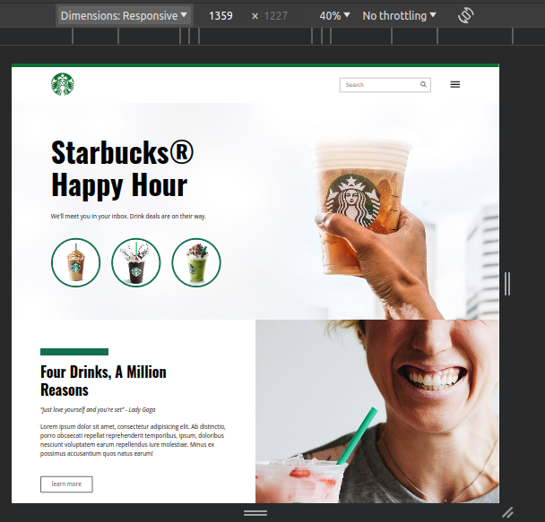
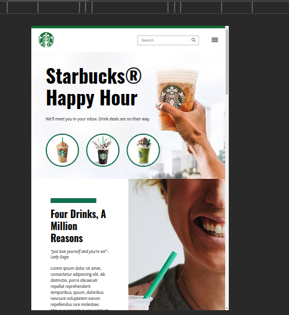
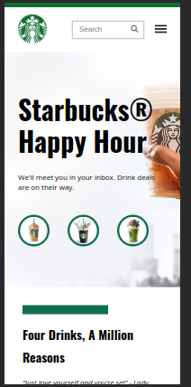

# Projeto Starbucks ☕

Construído durante o curso de HTML e CSS da B7Web.

#### Desktop:

#### Mobile:

## Deploy 📙:

Acesse o site <a style="color: deeppink;" href="https://starbuckspage-by-ericamonteiro.netlify.app/" target="_blank">aqui</a>.
